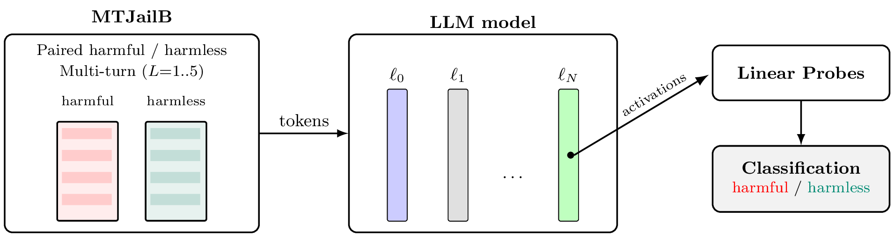

# Detecting Multi-Turn Jailbreak Attacks in Large Language Models via Linear Probes
**Lightweight multi-turn jailbreak detection via linear probes on LLM activations**

> **Abstract.** Multi-turn jailbreak attacks are a prominent threat for Large Language Models (LLMs). While internal LLM data has been used for single-turn jailbreaks, its suitability for multi-turn ones remains unexplored. This paper proposes a mechanism leveraging linear probes on layer activations. Interestingly, it enables characterizing the anticipation (or early warning) in the detection, which has never been measured. To support the assessment, a novel dataset with +10k harmful and harmless conversations is produced. Experiments on Llama, Qwen and Mistral models with different sizes show that the approach is specially effective in Llama, and that smaller versions of all models lead to better effectiveness and early warning.

---

## Overview
This repository provides a minimal, reproducible implementation of **linear-probe–based, multi-turn jailbreak detection** over open-source LLMs (e.g., LLaMA-1B, Qwen-4B, Mistral-7B).  
At a high level:
1) **Dataset**: paired harmful/harmless multi-turn conversations (MTJailB).
2) **Activation taps**: extract hidden activations from selected layers across turns.
3) **Linear probes**: lightweight classifiers operating on those activations.
4) **Detection signal**: per-turn scores aggregated into a multi-turn decision (with early-warning analysis in the paper).

  

---

## Repository layout
.\
├── answer_dataset.py\
├── multi_turn_lps.py\
├── README.md\
├── requirements.txt\
├── simsce.py\
├── wildguard_evaluate.py\
└── datasets/\
&nbsp;&nbsp;&nbsp;&nbsp;&nbsp;&nbsp;&nbsp;&nbsp;├── evaluated_llama_answered_harmful_dataset.json\
&nbsp;&nbsp;&nbsp;&nbsp;&nbsp;&nbsp;&nbsp;&nbsp;├── evaluated_llama_answered_harmless_dataset.json\
&nbsp;&nbsp;&nbsp;&nbsp;&nbsp;&nbsp;&nbsp;&nbsp;├── evaluated_mistral_answered_harmful_dataset.json\
&nbsp;&nbsp;&nbsp;&nbsp;&nbsp;&nbsp;&nbsp;&nbsp;├── evaluated_mistral_answered_harmless_dataset.json\
&nbsp;&nbsp;&nbsp;&nbsp;&nbsp;&nbsp;&nbsp;&nbsp;├── evaluated_qwen_answered_harmful_dataset.json\
&nbsp;&nbsp;&nbsp;&nbsp;&nbsp;&nbsp;&nbsp;&nbsp;└── evaluated_qwen_answered_harmless_dataset.json\

    
**Scripts**
- `answer_dataset.py` — prepares/answers MTJailB conversations to produce the responses of a selected model.
- `multi_turn_lps.py` — runs the linear-probe pipeline on model activations (extraction/train/eval).
- `simsce.py` — computes SimCSE-based semantic similarity diagnostics (e.g., prototype similarity, separability index).
- `wildguard_evaluate.py` — evaluation script to generate the evaluated JSONs in `datasets/` using WildGuard as an LLM Judge.

---

## Datasets
- The `datasets/` directory contains **evaluated** JSON files (harmful/harmless) for LLaMA, Qwen, and Mistral sources.  
- If you need to regenerate these files from raw MTJailB, use `answer_dataset.py` and `wildguard_evaluate.py` (see script help).

---

## Models
This project instruments open models representative of three families/sizes:
- **meta-llama/Llama-3.2-1B-Instruct**
- **Qwen/Qwen3-4B**
- **mistralai/Mistral-7B-Instruct-v0.3**

